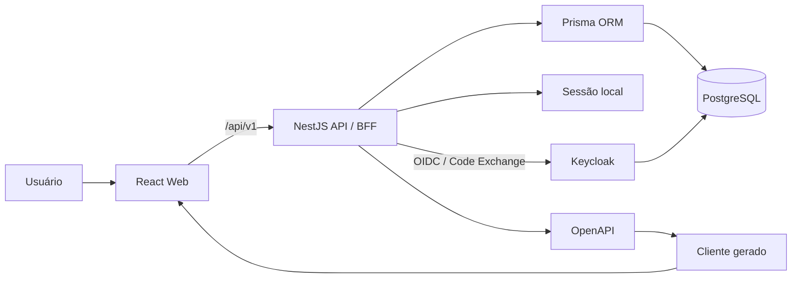
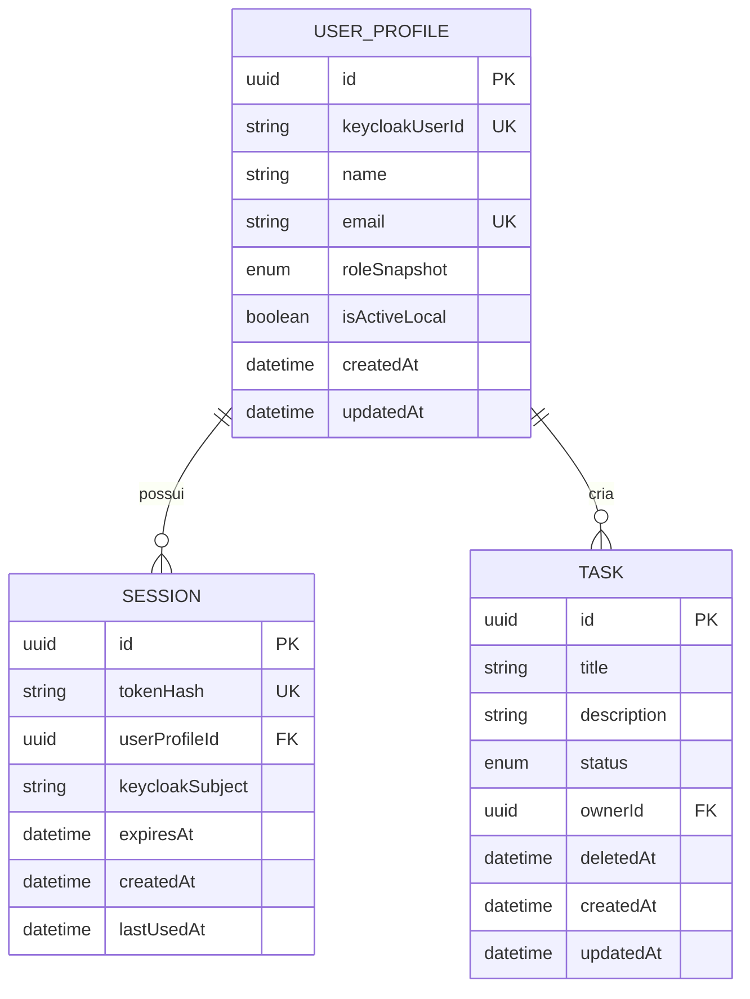
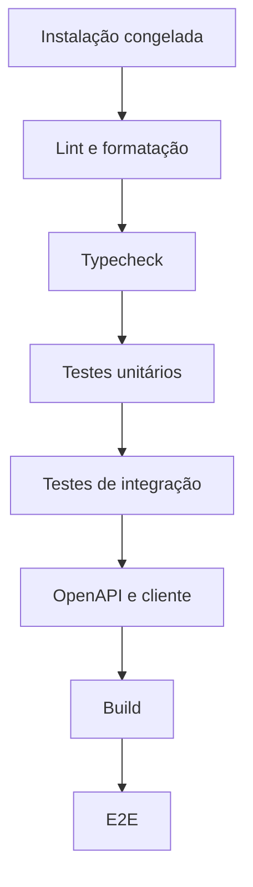

# AppStart — Documento de Requisitos de Software

**Título:** Software Requirements Document (SRD) — AppStart NestJS/React  
**Versão:** 1.0  
**Estado:** Baseline proposta  
**Data:** 25 de agosto de 2026  
**Responsável pelo produto:** A definir  
**Público-alvo:** docentes, alunos, mantenedores e equipes de infraestrutura  

---

## Controle do documento

| Versão | Data | Estado | Descrição |
| --- | --- | --- | --- |
| 0.1 | 25/08/2026 | Rascunho | Consolidação inicial das decisões arquiteturais. |
| 1.0 | 25/08/2026 | Baseline proposta | SRD completo para avaliação, implementação e aceite. |

### Aprovações necessárias

| Papel | Responsabilidade na aprovação | Estado |
| --- | --- | --- |
| Responsável acadêmico | Validar adequação pedagógica e escopo do template. | Pendente |
| Responsável técnico | Validar arquitetura, segurança e manutenção. | Pendente |
| Infraestrutura | Validar requisitos de execução e implantação. | Pendente |
| Representante dos alunos | Validar clareza da instalação e experiência inicial. | Pendente |

---

## 1. Introdução

### 1.1 Propósito

Este documento especifica os requisitos do **AppStart**, um arcabouço full stack para ensino e desenvolvimento de aplicações web. O projeto fornece uma base padronizada em TypeScript para que alunos possam concentrar o esforço na análise, no projeto e na implementação das funcionalidades de negócio, sem precisar reconstruir autenticação, acesso a banco, tratamento de erros, documentação de API, testes e configuração do ambiente em cada trabalho.

O SRD deve orientar:

- a implementação inicial do AppStart;
- a avaliação técnica e pedagógica pelos docentes;
- a criação de histórias, tarefas e critérios de aceite;
- a verificação de conformidade do template;
- a evolução controlada do projeto.

### 1.2 Escopo do produto

O AppStart será distribuído como um monorepositório contendo:

- uma API REST construída com NestJS;
- uma aplicação web construída com React e Vite;
- persistência PostgreSQL acessada por Prisma ORM;
- autenticação federada por Keycloak pré-configurado;
- realm, clients, papéis e usuários de desenvolvimento provisionados automaticamente no ambiente local;
- sessões locais opacas persistidas no PostgreSQL e transportadas por cookie seguro, mediadas pelo backend;
- autorização baseada em papéis mapeados a partir do provedor de identidade;
- componentes de interface baseados em shadcn/ui e Tailwind CSS;
- contrato OpenAPI e cliente TypeScript gerado;
- um módulo CRUD de referência;
- testes unitários, de integração e ponta a ponta;
- ambiente PostgreSQL iniciado por Docker Compose;
- automação de qualidade e integração contínua;
- um script de scaffolding guiado para criar aplicações derivadas a partir do template;
- geração automatizada de arquivos iniciais de configuração para novos projetos;
- documentação para alunos, docentes e mantenedores.

O produto é um **ponto de partida**, e não uma plataforma low-code, um gerador universal de aplicações ou um conjunto de microserviços.

### 1.3 Público do documento

- **Docentes:** avaliam se a base reduz carga acidental sem ocultar conceitos relevantes.
- **Alunos:** consultam requisitos, convenções e critérios de funcionamento.
- **Mantenedores:** implementam, revisam e evoluem o template.
- **Equipes de projeto:** derivam aplicações específicas a partir da base.
- **Infraestrutura:** prepara ambientes de CI, homologação e produção.

### 1.4 Convenções

Os requisitos usam identificadores estáveis. A prioridade segue a convenção MoSCoW:

| Prioridade | Significado |
| --- | --- |
| **Must** | Obrigatório para a versão 1.0. |
| **Should** | Importante, mas pode ser adiado sem impedir o primeiro uso. |
| **Could** | Desejável, condicionado a tempo e capacidade. |
| **Won't** | Explicitamente fora da versão 1.0. |

O termo **deve** indica requisito obrigatório; **deveria** indica recomendação ou requisito `Should`; **pode** indica possibilidade ou requisito `Could`.

### 1.5 Glossário

| Termo | Definição |
| --- | --- |
| API | Interface HTTP utilizada pela aplicação web e por clientes autorizados. |
| Aplicação derivada | Sistema criado a partir do AppStart para um domínio específico. |
| DTO | Objeto que define e valida dados de entrada ou saída da API. |
| Módulo de referência | Funcionalidade CRUD simples incluída para demonstrar o padrão arquitetural. |
| Monorepositório | Repositório que contém múltiplas aplicações e pacotes relacionados. |
| Sessão opaca | Credencial aleatória sem dados legíveis do usuário; sua validade depende de consulta ao servidor. |
| SRD | Software Requirements Document; Documento de Requisitos de Software. |
| RBAC | Controle de acesso baseado em papéis. |
| OpenAPI | Especificação formal do contrato da API REST. |
| CI | Integração contínua executada a cada mudança do repositório. |

---

## 2. Visão do produto

### 2.1 Problema

Projetos acadêmicos de software frequentemente consomem uma parcela significativa do tempo com configuração inicial, escolha de bibliotecas, conexão ao banco, autenticação e correção de incompatibilidades entre frontend e backend. Isso reduz o tempo disponível para práticas de Engenharia de Software, como elicitação, modelagem, implementação incremental, testes, integração e avaliação de qualidade.

O AppStart deve oferecer uma arquitetura inicial coerente, compreensível e modificável. Ele deve funcionar como **andaime técnico**: reduz o esforço incidental no começo, evidencia padrões e pode ser progressivamente compreendido, alterado ou removido pelos alunos.

### 2.2 Visão

> Fornecer uma base full stack padronizada, segura e didática, que possa ser instalada com poucos comandos, demonstre boas práticas de Engenharia de Software e permita que diferentes equipes desenvolvam aplicações web sem recriar infraestrutura comum.

### 2.3 Objetivos

| ID | Objetivo | Indicador de sucesso |
| --- | --- | --- |
| OBJ-01 | Reduzir o tempo até a primeira execução. | Um novo usuário executa o sistema localmente em até 20 minutos, excluindo o download inicial de dependências. |
| OBJ-02 | Padronizar a estrutura dos projetos. | Todas as funcionalidades de referência seguem organização por funcionalidade e convenções documentadas. |
| OBJ-03 | Evitar divergência entre frontend e API. | O cliente do frontend é gerado a partir do OpenAPI e a CI detecta artefatos desatualizados. |
| OBJ-04 | Fornecer autenticação segura pronta para uso. | Fluxos de login, logout, consulta do usuário e revogação de sessão passam nos testes de segurança definidos. |
| OBJ-05 | Usar banco próximo de produção sem exigir instalação local. | PostgreSQL é iniciado por um único comando Docker Compose. |
| OBJ-06 | Tornar a base ensinável. | Arquitetura, decisões, fluxos e pontos de extensão são documentados. |
| OBJ-07 | Permitir implantação real. | A aplicação pode ser construída como artefato de produção e configurada exclusivamente por variáveis de ambiente. |
| OBJ-08 | Reduzir erros na criação de projetos derivados. | Um aluno cria uma nova aplicação derivada sem editar manualmente arquivos estruturais do template. |

### 2.4 Não objetivos da versão 1.0

- oferecer microserviços, mensageria distribuída ou service mesh;
- implementar GraphQL;
- oferecer federação com provedores institucionais externos além do Keycloak local padrão, como Google, SAML ou OIDC corporativo;
- oferecer aplicativo móvel nativo;
- fornecer editor visual ou geração automática de domínio;
- hospedar ou operar aplicações derivadas;
- definir regras de negócio de um domínio específico;
- substituir disciplinas de banco de dados, segurança ou arquitetura;
- suportar múltiplos bancos na mesma história de migrations;
- oferecer multi-tenancy;
- implementar MFA na versão inicial.

---

## 3. Partes interessadas e classes de usuário

### 3.1 Partes interessadas

| Parte interessada | Interesse principal |
| --- | --- |
| Coordenação/docentes | Adequação pedagógica, comparabilidade entre projetos e manutenção. |
| Alunos desenvolvedores | Instalação simples, exemplos claros e feedback rápido. |
| Usuários das aplicações derivadas | Segurança, usabilidade, desempenho e confiabilidade. |
| Mantenedores do AppStart | Arquitetura estável, atualizações controladas e testes. |
| Infraestrutura | Imagens reproduzíveis, health checks, logs e configuração externa. |

### 3.2 Classes de usuário do produto-base

| Classe | Descrição | Permissões iniciais |
| --- | --- | --- |
| Visitante | Pessoa não autenticada. | Acessar login e endpoints explicitamente públicos. |
| Usuário | Pessoa autenticada com papel `USER`. | Acessar funcionalidades comuns e seus próprios dados. |
| Administrador | Pessoa autenticada com papel `ADMIN`. | Gerenciar usuários e acessar funções administrativas. |
| Desenvolvedor aluno | Pessoa que modifica uma aplicação derivada. | Usar scripts, documentação, testes e estrutura do repositório. |
| Mantenedor | Pessoa que evolui o template. | Alterar infraestrutura compartilhada e publicar versões. |

---

## 4. Premissas, dependências e restrições

### 4.1 Premissas

- O ambiente do desenvolvedor possui Git, Docker com Compose, Node.js e Corepack.
- O usuário possui permissão para iniciar containers e utilizar uma porta local configurável.
- As aplicações derivadas terão predominantemente perfil transacional e administrativo.
- A API e o frontend serão publicados sob a mesma origem sempre que possível.
- A primeira versão será mantida por uma equipe capaz de revisar dependências e migrations.

### 4.2 Restrições tecnológicas

| Área | Decisão |
| --- | --- |
| Linguagem | TypeScript no frontend, backend, testes e ferramentas próprias. |
| Runtime | Node.js 24 LTS, fixado no repositório. |
| Gerenciador | pnpm, com versão fixada no campo `packageManager`. |
| Monorepositório | pnpm workspaces; Turborepo para tarefas e cache. |
| Backend | NestJS, inicialmente com adaptador HTTP padrão Express. |
| Persistência | Prisma ORM e PostgreSQL. |
| Frontend | React, Vite e React Router. |
| Interface | shadcn/ui e Tailwind CSS. |
| Contrato | REST documentado por OpenAPI. |
| Autenticação | Keycloak pré-configurado como provedor de identidade; login mediado pelo backend; sessão local opaca em cookie. |

### 4.3 Dependências externas de desenvolvimento

- registro de pacotes npm;
- imagem oficial do PostgreSQL;
- imagem oficial do Keycloak;
- provedor de CI escolhido pelo repositório;
- navegador moderno para desenvolvimento e testes.

### 4.4 Compatibilidade de banco

O template principal não deve alternar automaticamente entre SQLite e PostgreSQL. As migrations do Prisma são específicas do provedor. Caso um tutorial com SQLite seja criado, ele deverá existir como exemplo ou template separado, com schema e histórico de migrations próprios.

---

## 5. Contexto e arquitetura do sistema

### 5.1 Contexto



### 5.2 Organização do monorepositório

```text
appstart/
├── apps/
│   ├── api/
│   │   ├── prisma/
│   │   ├── src/
│   │   │   ├── common/
│   │   │   ├── config/
│   │   │   └── modules/
│   │   └── test/
│   └── web/
│       └── src/
│           ├── app/
│           ├── components/
│           ├── features/
│           └── routes/
├── packages/
│   ├── api-client/
│   ├── ui/
│   ├── eslint-config/
│   └── typescript-config/
├── tests/
│   └── e2e/
├── compose.yaml
├── pnpm-workspace.yaml
├── turbo.json
└── package.json
```

### 5.3 Princípios arquiteturais

1. **Organização por funcionalidade:** código de uma funcionalidade deve permanecer próximo, evitando pastas globais separadas apenas por tipo técnico.
2. **Contrato explícito:** o OpenAPI é o contrato entre API e clientes.
3. **Dependências direcionadas:** domínio e casos de uso não devem depender de controllers ou detalhes de interface.
4. **Padrões visíveis:** abstrações devem reduzir repetição sem esconder o fluxo principal dos alunos.
5. **Segurança por padrão:** endpoints são privados, exceto quando explicitamente marcados como públicos.
6. **Configuração externa:** segredos e parâmetros ambientais não são incorporados ao código.
7. **Evolução incremental:** Redis, filas, WebSockets e serviços externos entram somente mediante requisito.

### 5.4 Organização interna de uma funcionalidade NestJS

```text
modules/users/
├── dto/
│   ├── create-user.dto.ts
│   └── update-user.dto.ts
├── users.controller.ts
├── users.service.ts
├── users.repository.ts
├── users.module.ts
└── users.spec.ts
```

O `repository` é recomendado quando encapsular consultas relevantes, regras de persistência ou facilitar testes. Não se deve criar camadas vazias que apenas repassem cada chamada do Prisma.

### 5.5 Organização interna de uma funcionalidade React

```text
features/users/
├── components/
├── hooks/
├── pages/
├── schemas/
└── index.ts
```

O cliente HTTP gerado não deve ser editado manualmente. Componentes genéricos ficam em `packages/ui`; componentes específicos permanecem na funcionalidade.

---

## 6. Requisitos funcionais

### 6.1 Instalação e inicialização

| ID | Prioridade | Requisito | Critério de aceite resumido |
| --- | --- | --- | --- |
| RF-SETUP-001 | Must | O repositório deve declarar versões suportadas de Node.js e pnpm. | Uma instalação com versões incompatíveis apresenta orientação clara ou falha de forma explícita. |
| RF-SETUP-002 | Must | O projeto deve fornecer `.env.example` sem segredos reais. | O arquivo contém todas as variáveis obrigatórias e comentários suficientes. |
| RF-SETUP-003 | Must | `pnpm setup` deve iniciar PostgreSQL e Keycloak, aguardar sua disponibilidade, importar a configuração de identidade, aplicar migrations e executar o seed de desenvolvimento. | Em clone novo, o comando termina com código zero e prepara os logins iniciais. |
| RF-SETUP-004 | Must | `pnpm dev` deve iniciar API e frontend em modo de desenvolvimento. | Alterações em ambos são refletidas sem rebuild manual. |
| RF-SETUP-005 | Must | O projeto deve fornecer comandos separados para iniciar, parar e inspecionar o banco. | `db:up`, `db:down` e `db:studio` são documentados e funcionais. |
| RF-SETUP-006 | Must | A falha por porta ocupada ou Docker indisponível deve ser diagnosticável. | A documentação apresenta causa provável e correção. |
| RF-SETUP-007 | Should | O setup deve funcionar em Linux, macOS e Windows com Docker Desktop/WSL2. | O fluxo é verificado ao menos em um ambiente de cada família antes da release. |

#### 6.1.1 Scaffolding guiado do projeto

| ID | Prioridade | Requisito | Critério de aceite resumido |
| --- | --- | --- | --- |
| RF-SCAF-001 | Must | O projeto deve fornecer um script de scaffolding guiado para criar uma aplicação derivada a partir do template. | Um usuário executa um único comando e responde perguntas para gerar um novo projeto. |
| RF-SCAF-002 | Must | O scaffolding deve copiar o template para um diretório de destino sem modificar o template original. | Após a execução, o boilerplate base permanece intacto. |
| RF-SCAF-003 | Must | O scaffolding deve solicitar ou aceitar por flags os metadados mínimos do projeto. | Nome do projeto, descrição, diretório de destino e parâmetros básicos são configurados sem edição manual obrigatória. |
| RF-SCAF-004 | Must | O scaffolding deve gerar `.env` a partir de `.env.example` com valores iniciais coerentes. | O projeto derivado possui arquivo `.env` pronto para revisão local. |
| RF-SCAF-005 | Must | O scaffolding deve inicializar o repositório Git da aplicação derivada. | O diretório gerado contém repositório Git funcional. |
| RF-SCAF-006 | Must | O scaffolding deve instalar dependências e orientar os próximos passos de execução. | Ao final, o usuário recebe instruções claras para setup e execução. |
| RF-SCAF-007 | Should | O scaffolding deveria suportar modo não interativo por flags. | O mesmo projeto pode ser criado via terminal sem prompts. |
| RF-SCAF-008 | Should | O scaffolding deveria validar pré-requisitos antes da cópia do projeto. | Falta de Node, Docker, Git ou package manager produz erro amigável antes do início. |
| RF-SCAF-009 | Should | O scaffolding deveria executar opcionalmente o bootstrap inicial do ambiente. | O usuário pode sair do processo com PostgreSQL, Keycloak, migrations e seed preparados. |

### 6.2 Banco de dados e migrations

| ID | Prioridade | Requisito | Critério de aceite resumido |
| --- | --- | --- | --- |
| RF-DB-001 | Must | O PostgreSQL de desenvolvimento deve ser disponibilizado por `compose.yaml`. | `docker compose up -d --wait postgres` produz serviço saudável. |
| RF-DB-002 | Must | O serviço deve usar volume nomeado para persistir dados entre reinícios. | Reiniciar o container não remove os dados. |
| RF-DB-003 | Must | Credenciais, porta e nome do banco devem aceitar configuração ambiental. | Alterar o `.env` altera a conexão sem modificar o Compose. |
| RF-DB-004 | Must | Toda alteração estrutural deve possuir migration Prisma versionada. | A CI detecta schema alterado sem migration correspondente. |
| RF-DB-005 | Must | O seed deve ser idempotente. | Duas execuções consecutivas não duplicam registros estruturais. |
| RF-DB-006 | Must | O setup de desenvolvimento deve provisionar de forma idempotente usuários `admin` e `user` configuráveis no Keycloak, sem persistir suas senhas no banco da aplicação. | Os logins definidos no `.env` funcionam após `pnpm setup`. |
| RF-DB-007 | Must | Migrations de produção devem ser aplicadas por `prisma migrate deploy`. | O procedimento de implantação não executa `migrate dev`. |
| RF-DB-008 | Should | O projeto deve oferecer procedimento documentado de reset apenas para desenvolvimento. | O comando alerta que a operação é destrutiva. |

### 6.3 Contas de usuário e perfis locais

| ID | Prioridade | Requisito | Critério de aceite resumido |
| --- | --- | --- | --- |
| RF-USR-001 | Must | Cada usuário da aplicação deve possuir um perfil local com UUID, `keycloakUserId`, nome, e-mail, papel efetivo e estado ativo local. | O modelo e as migrations contêm os campos e o vínculo com a identidade do Keycloak. |
| RF-USR-002 | Must | E-mails devem ser normalizados antes de persistência e comparação no perfil local. | Variações de maiúsculas/minúsculas não criam perfis duplicados. |
| RF-USR-003 | Must | O vínculo local com o usuário do Keycloak deve ser único. | O mesmo `keycloakUserId` não pode gerar mais de um perfil local. |
| RF-USR-004 | Must | Administradores devem poder listar usuários com paginação e filtro sem exigir acesso direto ao console do Keycloak. | A resposta respeita limites, ordenação e autorização. |
| RF-USR-005 | Must | Administradores devem poder criar contas por meio da aplicação, com provisionamento correspondente no Keycloak. | A conta criada recebe identidade válida no provedor e perfil local sincronizado. |
| RF-USR-006 | Must | Administradores devem poder ativar e desativar contas por meio da aplicação. | Usuário desativado perde acesso e suas sessões locais são revogadas. |
| RF-USR-007 | Must | Usuários devem poder consultar seu próprio perfil. | O endpoint retorna apenas dados permitidos e coerentes com a identidade autenticada. |
| RF-USR-008 | Should | Usuários deveriam poder alterar seu nome de exibição, com sincronização ou reconciliação com o provedor de identidade. | Alteração válida é persistida e refletida em `/auth/me`. |
| RF-USR-009 | Should | O cadastro público deve ser controlado por configuração e permanecer desabilitado por padrão. | O template não exige cadastro aberto para uso acadêmico inicial. |
| RF-USR-010 | Should | A exclusão padrão de usuário deve ser lógica ou substituída por desativação. | Dados relacionais e rastreabilidade não são removidos inadvertidamente. |

### 6.4 Credenciais e senhas

| ID | Prioridade | Requisito | Critério de aceite resumido |
| --- | --- | --- | --- |
| RF-PWD-001 | Must | Senhas devem ser gerenciadas pelo Keycloak; a aplicação não deve persistir senha nem `passwordHash`. | Nenhuma senha ou hash de senha aparece no banco da aplicação. |
| RF-PWD-002 | Must | A política de senha do Keycloak deve aceitar senhas longas, espaços e caracteres Unicode sem truncamento silencioso. | Casos de teste cobrem esses valores por meio do fluxo do provedor. |
| RF-PWD-003 | Must | O ambiente padrão deve provisionar política mínima de senha configurável no Keycloak, sem regras artificiais de composição além do necessário. | A configuração padrão é documentada e aplicada automaticamente. |
| RF-PWD-004 | Must | Usuários autenticados devem poder alterar a senha por fluxo mediado ou redirecionado ao Keycloak. | Alteração correta invalida ou torna inservíveis as sessões locais conforme a política definida. |
| RF-PWD-005 | Must | Erros de autenticação não devem revelar se o e-mail existe. | Falhas upstream e identidade inexistente retornam mensagem pública equivalente. |
| RF-PWD-006 | Should | O frontend deveria apresentar orientação clara de que credenciais são gerenciadas pelo provedor de identidade. | O fluxo evita exigir que o aluno entenda o console do Keycloak para o uso normal. |
| RF-PWD-007 | Should | O projeto deveria oferecer fluxo de redefinição de senha usando capacidades nativas do Keycloak. | O usuário consegue redefinir credenciais sem mecanismo paralelo na aplicação. |
| RF-PWD-008 | Could | O template pode ativar verificações adicionais de senhas fracas se suportadas pelo provedor. | A configuração não exige integração manual pelos alunos. |

### 6.5 Login e logout

| ID | Prioridade | Requisito | Critério de aceite resumido |
| --- | --- | --- | --- |
| RF-AUTH-001 | Must | Visitantes devem autenticar-se por redirecionamento iniciado pela aplicação para o Keycloak. | Autenticação válida no provedor cria sessão local e retorna usuário seguro. |
| RF-AUTH-002 | Must | Um login bem-sucedido deve gerar token de sessão local criptograficamente aleatório. | Tokens de sessões distintas não se repetem e possuem entropia adequada. |
| RF-AUTH-003 | Must | Apenas o hash do token de sessão local deve ser persistido. | O valor do cookie não está presente literalmente no banco. |
| RF-AUTH-004 | Must | O token de sessão local deve ser enviado em cookie `HttpOnly`, `SameSite=Lax`, `Path=/` e `Secure` em produção. | Os atributos são verificados em teste E2E. |
| RF-AUTH-005 | Must | A aplicação não deve armazenar credenciais de sessão nem tokens OIDC em `localStorage` ou `sessionStorage`. | Inspeção e testes confirmam ausência. |
| RF-AUTH-006 | Must | Usuários devem encerrar a sessão atual por logout local, com tentativa de encerramento federado quando aplicável. | Logout remove a sessão no servidor, expira o cookie e tenta encerrar a sessão no Keycloak. |
| RF-AUTH-007 | Must | O endpoint `/auth/me` deve informar o usuário da sessão atual. | Sessão válida retorna perfil; ausência retorna 401. |
| RF-AUTH-008 | Must | O fluxo OIDC deve validar `state`, `nonce` e demais artefatos de correlação exigidos pela arquitetura. | Callback inválido ou adulterado é rejeitado sem criar sessão. |
| RF-AUTH-009 | Must | O sistema deve criar uma nova sessão local após autenticação, prevenindo fixação. | Identificador anterior não permanece válido. |
| RF-AUTH-010 | Must | Contas desativadas localmente ou desabilitadas no provedor não devem autenticar-se. | Tentativa apresenta falha genérica e não cria sessão. |
| RF-AUTH-011 | Should | O usuário deveria poder encerrar todas as suas sessões locais. | Todas as sessões, exceto opcionalmente a atual, deixam de funcionar. |

### 6.6 Gerenciamento de sessão

| ID | Prioridade | Requisito | Critério de aceite resumido |
| --- | --- | --- | --- |
| RF-SES-001 | Must | Sessões locais devem possuir expiração absoluta configurável. | Sessão expirada retorna 401 e é elegível para limpeza. |
| RF-SES-002 | Must | O sistema deve registrar criação, última utilização, expiração e vínculo com a identidade federada da sessão. | Campos existem e são atualizados sem expor o token. |
| RF-SES-003 | Must | Logout federado ou invalidação relevante no provedor deve revogar ou inutilizar as sessões locais aplicáveis. | Cookies antigos deixam de autenticar após revogação reconhecida. |
| RF-SES-004 | Must | Desativação de usuário deve revogar todas as sessões locais. | Nenhuma sessão anterior continua autorizada. |
| RF-SES-005 | Must | Deve existir tarefa segura de limpeza de sessões expiradas. | Registros expirados são removidos sem afetar sessões válidas. |
| RF-SES-006 | Should | O número de sessões simultâneas por usuário deveria ser configurável. | Ao exceder o limite, a política documentada é aplicada. |

### 6.7 Autorização

| ID | Prioridade | Requisito | Critério de aceite resumido |
| --- | --- | --- | --- |
| RF-AUTZ-001 | Must | Todo endpoint deve ser protegido por padrão. | Somente endpoints marcados explicitamente como públicos dispensam sessão. |
| RF-AUTZ-002 | Must | O sistema deve oferecer decorator e guard para papéis mapeados a partir das roles do Keycloak. | Endpoint administrativo rejeita sessão sem role `ADMIN` efetiva com 403. |
| RF-AUTZ-003 | Must | A autorização deve ser validada no backend, independentemente da interface. | Chamada HTTP direta não contorna a restrição visual. |
| RF-AUTZ-004 | Must | A interface deve ocultar ou desabilitar ações incompatíveis com o papel. | Usuário comum não vê ações administrativas. |
| RF-AUTZ-005 | Must | O papel não deve ser aceito de entrada em operações de autoatendimento. | Usuário não consegue elevar o próprio papel por mass assignment nem por manipulação de payload local. |
| RF-AUTZ-006 | Should | A arquitetura deveria permitir evolução de papéis para permissões granulares. | Serviços não dependem de condicionais espalhadas pelo código. |

### 6.8 API e contrato

| ID | Prioridade | Requisito | Critério de aceite resumido |
| --- | --- | --- | --- |
| RF-API-001 | Must | A API deve usar prefixo versionado `/api/v1`. | Todas as rotas de negócio seguem o prefixo. |
| RF-API-002 | Must | DTOs de entrada devem ser validados globalmente e rejeitar propriedades não autorizadas. | Payload inválido retorna 400 e propriedade extra não é aplicada. |
| RF-API-003 | Must | A API deve produzir especificação OpenAPI válida. | O documento passa em validação automática. |
| RF-API-004 | Must | Operações protegidas e respostas relevantes devem estar descritas no OpenAPI. | Segurança, DTOs, códigos e parâmetros aparecem no documento. |
| RF-API-005 | Must | O cliente TypeScript deve ser gerado automaticamente a partir do OpenAPI. | Frontend compila sem duplicar manualmente tipos de resposta. |
| RF-API-006 | Must | A CI deve detectar cliente gerado desatualizado. | Alterar o contrato sem regenerar causa falha. |
| RF-API-007 | Must | Erros devem seguir envelope padronizado inspirado em Problem Details. | Erros possuem `status`, `code`, `title`, `detail`, `requestId` e erros de campo quando aplicável. |
| RF-API-008 | Must | Listagens devem usar paginação e limite máximo configurado. | Não é possível solicitar coleção ilimitada. |
| RF-API-009 | Must | Datas e horas devem trafegar em ISO 8601 e UTC. | Testes verificam serialização consistente. |
| RF-API-010 | Must | Respostas não devem expor `tokenHash`, segredos do provedor ou credenciais administrativas. | Testes de serialização cobrem os campos sensíveis. |
| RF-API-011 | Should | A interface Swagger deveria ser habilitada em desenvolvimento e configurável em produção. | Variável ambiental controla sua exposição. |
| RF-API-012 | Must | Operações mutáveis autenticadas por cookie devem exigir proteção contra CSRF por token e validação de origem. | Requisição sem proteção válida é rejeitada. |

### 6.9 Aplicação web

| ID | Prioridade | Requisito | Critério de aceite resumido |
| --- | --- | --- | --- |
| RF-WEB-001 | Must | A aplicação deve possuir página ou entrypoint de login que inicie o fluxo com o Keycloak. | Exibe orientação clara, estado de envio e erro genérico quando aplicável. |
| RF-WEB-002 | Must | A aplicação deve possuir shell autenticado com navegação, área de conteúdo e menu do usuário. | Layout funciona nas rotas protegidas. |
| RF-WEB-003 | Must | Rotas privadas devem verificar a sessão antes de renderizar conteúdo sensível. | Visitante é redirecionado ao início do login mediado pela aplicação. |
| RF-WEB-004 | Must | Após autenticação via callback, o usuário deve retornar à rota originalmente solicitada, quando segura. | URL interna é preservada; redirecionamento externo é rejeitado. |
| RF-WEB-005 | Must | TanStack Query deve gerenciar dados remotos, cache e invalidação. | CRUD atualiza a tela sem recarregamento integral. |
| RF-WEB-006 | Must | React Hook Form e Zod devem ser usados no formulário de referência. | Validação de cliente e mensagens de campo funcionam. |
| RF-WEB-007 | Must | O cliente gerado deve centralizar a comunicação HTTP. | Funcionalidades não criam tipos divergentes nem URLs duplicadas. |
| RF-WEB-008 | Must | Telas de dados devem possuir estados de carregamento, vazio, erro e sucesso. | Cada estado pode ser demonstrado ou testado. |
| RF-WEB-009 | Must | Erros 401 devem limpar estado autenticado e conduzir ao reinício do login. | Sessão expirada ou inválida não deixa interface em estado incorreto. |
| RF-WEB-010 | Must | A interface deve apresentar feedback para ações concluídas ou rejeitadas. | Usuário recebe confirmação ou erro contextual. |
| RF-WEB-011 | Must | A interface deve oferecer tema claro e escuro. | Preferência pode seguir o sistema e ser alterada. |
| RF-WEB-012 | Should | A navegação deveria ser responsiva para telas móveis e desktop. | Fluxos principais funcionam a partir de 360 px de largura. |
| RF-WEB-013 | Should | Páginas deveriam possuir títulos e breadcrumbs coerentes. | Navegação informa contexto atual. |

### 6.10 Módulo CRUD de referência

| ID | Prioridade | Requisito | Critério de aceite resumido |
| --- | --- | --- | --- |
| RF-REF-001 | Must | O projeto deve incluir um módulo de referência simples, denominado `tasks` ou equivalente. | Módulo funciona após o seed sem configuração adicional. |
| RF-REF-002 | Must | O módulo deve demonstrar criação, listagem, consulta, edição e remoção lógica. | Todos os fluxos possuem API, interface e testes. |
| RF-REF-003 | Must | A listagem deve demonstrar paginação, busca e ordenação. | Parâmetros são refletidos no backend e na URL quando apropriado. |
| RF-REF-004 | Must | O módulo deve demonstrar validação de DTO, formulário Zod e erro de negócio. | Pelo menos uma regra não trivial é coberta nos dois lados. |
| RF-REF-005 | Must | Registros devem possuir proprietário e respeitar autorização. | Usuário comum não altera registro alheio; administrador pode gerenciar conforme política. |
| RF-REF-006 | Must | O módulo deve demonstrar testes unitários, integração da API e E2E. | A documentação aponta cada exemplo. |
| RF-REF-007 | Must | A documentação deve explicar como renomear ou remover o módulo. | Remoção seguindo o guia não quebra build nem testes restantes. |

### 6.11 Saúde, logs e diagnóstico

| ID | Prioridade | Requisito | Critério de aceite resumido |
| --- | --- | --- | --- |
| RF-OPS-001 | Must | A API deve expor health check de liveness. | Endpoint responde sem depender de serviços externos dispensáveis. |
| RF-OPS-002 | Must | A API deve expor health check de readiness incluindo o banco. | Banco indisponível torna readiness não saudável. |
| RF-OPS-003 | Must | Cada requisição deve possuir `requestId`. | Resposta de erro e logs permitem correlacionar a requisição. |
| RF-OPS-004 | Must | Logs de produção devem ser estruturados em JSON. | Saída pode ser processada por coletor de logs. |
| RF-OPS-005 | Must | Logs locais devem possuir formato legível. | Desenvolvedor identifica método, rota, status e duração. |
| RF-OPS-006 | Must | Senhas, cookies, tokens e hashes de sessão não devem ser registrados. | Testes ou revisão automática verificam redação. |
| RF-OPS-007 | Should | O projeto deveria possuir integração opcional com monitoramento de erros. | Integração é ativada apenas por configuração. |

### 6.12 Documentação e apoio pedagógico

| ID | Prioridade | Requisito | Critério de aceite resumido |
| --- | --- | --- | --- |
| RF-DOC-001 | Must | O README deve apresentar requisitos, instalação e primeiro login. | Um aluno segue o documento em um clone novo. |
| RF-DOC-002 | Must | Deve existir guia de arquitetura com diagramas e responsabilidades. | Aplicações, pacotes e fluxo de uma requisição estão explicados. |
| RF-DOC-003 | Must | Deve existir guia para criação de uma nova funcionalidade. | Guia cobre migration, módulo Nest, contrato, cliente e tela React. |
| RF-DOC-004 | Must | Deve existir guia de testes. | Comandos, escopos e exemplos estão documentados. |
| RF-DOC-005 | Must | Decisões arquiteturais relevantes devem possuir ADRs. | Banco, autenticação, monorepo e contrato possuem registro. |
| RF-DOC-006 | Must | A documentação deve distinguir desenvolvimento e produção. | Credenciais de exemplo não são apresentadas como seguras para produção. |
| RF-DOC-007 | Should | Deve existir guia do docente para preparar e atualizar projetos de turma. | Procedimento inclui fork/template, atualização e solução de problemas. |
| RF-DOC-008 | Should | Deve existir glossário de conceitos técnicos utilizados. | Aluno encontra definições e links de aprofundamento. |
| RF-DOC-009 | Must | Deve existir documentação do fluxo de scaffolding guiado. | Um aluno consegue gerar uma aplicação derivada apenas seguindo o guia. |
| RF-DOC-010 | Should | Deve existir documentação para docentes criarem rapidamente projetos para equipes ou turmas. | O guia cobre uso interativo e automatizado do scaffolding. |

---

## 7. Modelo de dados conceitual

### 7.1 Entidades principais



### 7.2 Regras de integridade

| ID | Regra |
| --- | --- |
| RD-001 | `UserProfile.email` deve ser único após normalização. |
| RD-002 | `UserProfile.keycloakUserId` deve ser único. |
| RD-003 | `Session.tokenHash` deve ser único. |
| RD-004 | Remover um perfil local fisicamente, quando excepcionalmente permitido, deve remover suas sessões. |
| RD-005 | Sessão expirada nunca deve autenticar, mesmo antes da limpeza física. |
| RD-006 | `tokenHash` e segredos do provedor jamais devem compor DTO público. |
| RD-007 | Todos os horários devem ser persistidos e interpretados em UTC. |
| RD-008 | O módulo de referência deve preservar autoria e impedir alteração indevida por outro usuário. |
| RD-009 | Campos usados em busca, relações e limpeza periódica devem possuir índices adequados. |

### 7.3 Retenção

- Sessões expiradas devem ser removidas por tarefa periódica configurável.
- Perfis locais desativados e vínculos com o provedor podem ser retidos para integridade e auditoria.
- Dados do módulo de referência seguem a política da aplicação derivada.
- Logs não devem reter dados pessoais além do necessário ao diagnóstico.
- Aplicações derivadas devem documentar sua própria política de retenção e base legal quando aplicável.

---

## 8. Especificação das interfaces

### 8.1 Rotas mínimas da API

| Método | Rota | Acesso | Finalidade |
| --- | --- | --- | --- |
| `GET` | `/api/v1/auth/login` | Público | Iniciar autenticação com redirecionamento para o Keycloak. |
| `GET` | `/api/v1/auth/callback` | Público | Receber callback OIDC, validar artefatos de correlação e criar sessão local. |
| `POST` | `/api/v1/auth/logout` | Autenticado | Encerrar sessão atual e tentar logout federado. |
| `POST` | `/api/v1/auth/logout-all` | Autenticado | Encerrar todas as sessões locais do usuário. |
| `GET` | `/api/v1/auth/me` | Autenticado | Obter usuário atual. |
| `GET` | `/api/v1/auth/account` | Autenticado | Redirecionar para gerenciamento de conta ou senha no Keycloak, quando aplicável. |
| `GET` | `/api/v1/users` | `ADMIN` | Listar usuários. |
| `POST` | `/api/v1/users` | `ADMIN` | Criar usuário com provisionamento no Keycloak. |
| `GET` | `/api/v1/users/:id` | `ADMIN` | Consultar usuário. |
| `PATCH` | `/api/v1/users/:id` | `ADMIN` | Atualizar perfil local ou metadados sincronizados. |
| `PATCH` | `/api/v1/users/:id/status` | `ADMIN` | Ativar ou desativar conta. |
| `GET` | `/api/v1/tasks` | Autenticado | Listar registros de referência. |
| `POST` | `/api/v1/tasks` | Autenticado | Criar registro. |
| `GET` | `/api/v1/tasks/:id` | Autenticado | Consultar registro. |
| `PATCH` | `/api/v1/tasks/:id` | Autenticado/autorizado | Atualizar registro. |
| `DELETE` | `/api/v1/tasks/:id` | Autenticado/autorizado | Remover logicamente. |
| `GET` | `/health/live` | Público/restrito por infraestrutura | Liveness. |
| `GET` | `/health/ready` | Público/restrito por infraestrutura | Readiness. |

### 8.2 Contrato de erro

Respostas de erro devem adotar `application/problem+json` quando viável:

```json
{
  "type": "https://appstart.example/problems/validation-error",
  "title": "Dados inválidos",
  "status": 400,
  "detail": "Um ou mais campos precisam ser corrigidos.",
  "instance": "/api/v1/users",
  "code": "VALIDATION_ERROR",
  "requestId": "01J...",
  "errors": {
    "email": ["Informe um e-mail válido."]
  }
}
```

Regras:

- `code` deve ser estável e apropriado para decisões do cliente;
- `detail` pode ser localizado e não deve ser usado como identificador lógico;
- erros inesperados não devem expor stack trace ou detalhes internos;
- `requestId` deve permitir correlação com logs;
- erros de autenticação devem evitar enumeração de usuários.

### 8.3 Paginação

Parâmetros mínimos:

| Parâmetro | Regra padrão |
| --- | --- |
| `page` | Inteiro a partir de 1. |
| `pageSize` | Padrão 20; máximo 100. |
| `sort` | Campo permitido explicitamente. |
| `order` | `asc` ou `desc`. |
| `search` | Texto normalizado e limitado. |

Formato de resposta:

```json
{
  "data": [],
  "meta": {
    "page": 1,
    "pageSize": 20,
    "totalItems": 0,
    "totalPages": 0
  }
}
```

### 8.4 Cookie de sessão

O cookie de sessão é emitido pela aplicação após o callback bem-sucedido com o Keycloak.

| Atributo | Desenvolvimento | Produção |
| --- | --- | --- |
| Nome | `appstart_session` | Configurável; prefixo seguro quando aplicável. |
| `HttpOnly` | `true` | `true` |
| `Secure` | Conforme HTTPS local | `true` |
| `SameSite` | `Lax` | `Lax`, salvo requisito documentado diferente. |
| `Path` | `/` | `/` |
| Expiração | Configurável | Configurável e documentada. |

### 8.5 Variáveis ambientais mínimas

| Variável | Obrigatória | Finalidade |
| --- | --- | --- |
| `NODE_ENV` | Sim em produção | Define comportamento ambiental. |
| `API_PORT` | Não | Porta da API. |
| `DATABASE_URL` | Sim | Conexão Prisma com PostgreSQL da aplicação. |
| `POSTGRES_DB` | Sim no Compose | Banco da aplicação em desenvolvimento. |
| `POSTGRES_USER` | Sim no Compose | Usuário de desenvolvimento. |
| `POSTGRES_PASSWORD` | Sim no Compose | Senha de desenvolvimento. |
| `POSTGRES_PORT` | Não | Porta publicada pelo Compose. |
| `KEYCLOAK_DB_NAME` | Sim no Compose | Banco dedicado ao Keycloak no PostgreSQL local. |
| `KEYCLOAK_PORT` | Não | Porta HTTP local do Keycloak. |
| `KEYCLOAK_BASE_URL` | Sim | URL base do Keycloak. |
| `KEYCLOAK_REALM` | Sim | Realm padrão provisionado para a aplicação. |
| `KEYCLOAK_CLIENT_ID` | Sim | Client usado pela aplicação para iniciar autenticação. |
| `KEYCLOAK_CLIENT_SECRET` | Conforme fluxo | Segredo do client confidencial quando aplicável. |
| `KEYCLOAK_ADMIN_USER` | Desenvolvimento | Conta administrativa local para provisionamento. |
| `KEYCLOAK_ADMIN_PASSWORD` | Desenvolvimento | Senha administrativa local do Keycloak. |
| `KEYCLOAK_PASSWORD_MIN_LENGTH` | Não | Comprimento mínimo das senhas do realm local. |
| `SESSION_TTL_HOURS` | Não | Duração absoluta da sessão local. |
| `SESSION_COOKIE_NAME` | Não | Nome do cookie. |
| `DEV_ADMIN_EMAIL` | Desenvolvimento | E-mail do usuário administrador de demonstração. |
| `DEV_ADMIN_PASSWORD` | Desenvolvimento | Senha do usuário administrador de demonstração. |
| `DEV_USER_EMAIL` | Desenvolvimento | E-mail do usuário comum de demonstração. |
| `DEV_USER_PASSWORD` | Desenvolvimento | Senha do usuário comum de demonstração. |
| `SWAGGER_ENABLED` | Não | Controla a interface de documentação. |
| `LOG_LEVEL` | Não | Nível mínimo de log. |

Todas as variáveis devem ser validadas no início. A API deve falhar rapidamente com mensagem clara quando configuração obrigatória estiver ausente ou inválida.

---

## 9. Requisitos não funcionais

### 9.1 Segurança

| ID | Prioridade | Requisito verificável |
| --- | --- | --- |
| RNF-SEC-001 | Must | Todo tráfego de produção deve usar HTTPS. |
| RNF-SEC-002 | Must | O Keycloak deve ser provisionado com política de senha documentada e revisável; a aplicação não deve armazenar senha nem hash de senha localmente. |
| RNF-SEC-003 | Must | Tokens devem ser gerados por CSPRNG e possuir ao menos 256 bits de entropia. |
| RNF-SEC-004 | Must | Comparações sensíveis devem evitar diferenças observáveis desnecessárias. |
| RNF-SEC-005 | Must | Helmet e cabeçalhos seguros devem ser habilitados e testados. |
| RNF-SEC-006 | Must | CORS deve ser desabilitado quando desnecessário ou limitado a origens explicitamente configuradas. |
| RNF-SEC-007 | Must | Métodos mutáveis autenticados por cookie devem possuir defesa CSRF compatível com a arquitetura de mesma origem. |
| RNF-SEC-008 | Must | O servidor deve validar `Content-Type`, tamanho de payload e DTO. |
| RNF-SEC-009 | Must | O sistema deve impedir mass assignment por whitelist de propriedades. |
| RNF-SEC-010 | Must | Segredos não devem ser versionados nem incluídos em imagens de frontend. |
| RNF-SEC-011 | Must | Dependências devem ser verificadas na CI quanto a vulnerabilidades conhecidas. |
| RNF-SEC-012 | Must | Falhas de autorização devem retornar 403; ausência ou invalidade de autenticação deve retornar 401. |
| RNF-SEC-013 | Must | Logs devem redigir `authorization`, `cookie`, senhas, tokens e hashes. |
| RNF-SEC-014 | Must | A documentação deve incluir procedimento de resposta a comprometimento de credenciais. |
| RNF-SEC-015 | Should | Ações administrativas relevantes deveriam produzir evento de auditoria sem dados secretos. |
| RNF-SEC-016 | Should | A CI deveria gerar inventário ou relatório de dependências da release. |

### 9.2 Desempenho

| ID | Prioridade | Requisito verificável |
| --- | --- | --- |
| RNF-PERF-001 | Must | Endpoints CRUD simples devem responder em p95 inferior a 500 ms sob 50 requisições concorrentes, em ambiente de referência documentado e sem contar o primeiro aquecimento. |
| RNF-PERF-002 | Must | O login mediado pelo Keycloak deve possuir meta p95 inferior a 1.000 ms no ambiente de referência após aquecimento, excluindo indisponibilidades externas anômalas. |
| RNF-PERF-003 | Must | Toda listagem potencialmente crescente deve ser paginada. |
| RNF-PERF-004 | Must | Consultas do módulo de referência não devem apresentar padrão N+1. |
| RNF-PERF-005 | Should | Rotas do frontend deveriam usar divisão de código quando isso reduzir significativamente o bundle inicial. |
| RNF-PERF-006 | Should | A interface deveria apresentar feedback perceptível em até 100 ms após uma ação do usuário, ainda que a operação continue assíncrona. |

### 9.3 Confiabilidade e recuperação

| ID | Prioridade | Requisito verificável |
| --- | --- | --- |
| RNF-REL-001 | Must | A API deve encerrar conexões de forma graciosa ao receber sinal de término. |
| RNF-REL-002 | Must | Falha de conexão com banco deve ser registrada e refletida no readiness. |
| RNF-REL-003 | Must | Migrations devem ser versionadas, revisáveis e aplicáveis de forma não interativa em produção. |
| RNF-REL-004 | Must | Seed de desenvolvimento não deve ser executado implicitamente em produção. |
| RNF-REL-005 | Should | A documentação de produção deveria incluir backup, restauração e rollback compatíveis com a aplicação derivada. |
| RNF-REL-006 | Should | Operações compostas que exigem atomicidade deveriam usar transações. |

### 9.4 Usabilidade e acessibilidade

| ID | Prioridade | Requisito verificável |
| --- | --- | --- |
| RNF-UX-001 | Must | Fluxos do template devem atender WCAG 2.2 nível AA como meta de projeto. |
| RNF-UX-002 | Must | Todas as funções essenciais devem ser operáveis por teclado. |
| RNF-UX-003 | Must | Campos devem possuir rótulos associados, mensagens compreensíveis e indicação não baseada apenas em cor. |
| RNF-UX-004 | Must | Foco deve ser visível e corretamente gerenciado em diálogos e mudanças relevantes. |
| RNF-UX-005 | Must | Contraste dos temas deve ser verificado automaticamente quando possível. |
| RNF-UX-006 | Must | Estados de carregamento não devem provocar mudanças de layout evitáveis ou bloquear toda a aplicação sem necessidade. |
| RNF-UX-007 | Should | A interface deveria funcionar nos navegadores modernos cobertos pelo Playwright. |
| RNF-UX-008 | Should | Textos do template deveriam estar centralizados para permitir futura internacionalização, sem exigir biblioteca i18n na versão 1.0. |
| RNF-UX-009 | Should | O fluxo de scaffolding deveria usar linguagem clara, mensagens orientativas e falhas recuperáveis para usuários iniciantes. |

### 9.5 Manutenibilidade

| ID | Prioridade | Requisito verificável |
| --- | --- | --- |
| RNF-MAN-001 | Must | TypeScript deve operar em modo estrito. |
| RNF-MAN-002 | Must | ESLint e Prettier devem possuir configurações compartilhadas. |
| RNF-MAN-003 | Must | `lint`, `typecheck`, `test` e `build` devem funcionar na raiz do monorepo. |
| RNF-MAN-004 | Must | O código não deve importar internals de outro workspace sem exportação pública. |
| RNF-MAN-005 | Must | Código gerado deve estar claramente identificado e não ser editado manualmente. |
| RNF-MAN-006 | Must | Dependências circulares entre módulos devem ser evitadas e detectadas quando viável. |
| RNF-MAN-007 | Must | Atualizações de dependências principais devem registrar impacto e migration guide quando houver breaking change. |
| RNF-MAN-008 | Should | Funções e classes deveriam manter complexidade suficiente para revisão por alunos; abstrações complexas exigem justificativa. |
| RNF-MAN-009 | Should | ADRs deveriam ser imutáveis; decisões substituídas apontam para novo ADR. |

### 9.6 Portabilidade e reprodutibilidade

| ID | Prioridade | Requisito verificável |
| --- | --- | --- |
| RNF-PORT-001 | Must | O lockfile do pnpm deve ser versionado e respeitado na CI com instalação congelada. |
| RNF-PORT-002 | Must | A imagem PostgreSQL deve fixar ao menos a versão principal. |
| RNF-PORT-003 | Must | O build não deve depender de arquivos locais não versionados, exceto configuração ambiental declarada. |
| RNF-PORT-004 | Must | O projeto deve funcionar em sistemas de arquivos sensíveis a maiúsculas e minúsculas. |
| RNF-PORT-005 | Should | O ambiente de desenvolvimento pode oferecer Dev Container, sem torná-lo obrigatório. |

### 9.7 Observabilidade

| ID | Prioridade | Requisito verificável |
| --- | --- | --- |
| RNF-OBS-001 | Must | Logs HTTP devem incluir método, rota, status, duração e `requestId`. |
| RNF-OBS-002 | Must | Eventos de autenticação devem ser registrados sem e-mail integral quando isso for desnecessário e sem credenciais. |
| RNF-OBS-003 | Must | Health checks devem distinguir processo vivo de serviço pronto. |
| RNF-OBS-004 | Should | Métricas e rastreamento distribuído deveriam possuir pontos de extensão documentados. |
| RNF-OBS-005 | Could | A aplicação pode oferecer integração opt-in com OpenTelemetry ou serviço de erros. |

### 9.8 Privacidade

| ID | Prioridade | Requisito verificável |
| --- | --- | --- |
| RNF-PRIV-001 | Must | O template deve coletar apenas dados necessários à autenticação e ao exemplo. |
| RNF-PRIV-002 | Must | Senhas nunca devem ser recuperáveis. |
| RNF-PRIV-003 | Must | Aplicações derivadas devem documentar finalidade e retenção de novos dados pessoais. |
| RNF-PRIV-004 | Should | Logs deveriam pseudonimizar identificadores quando a identificação direta não for necessária. |

---

## 10. Experiência de desenvolvimento

### 10.1 Jornada inicial esperada

**Fluxo A — uso direto do template**

```bash
git clone <repositorio>
cd appstart
corepack enable
pnpm install --frozen-lockfile
cp .env.example .env
pnpm setup
pnpm dev
```

**Fluxo B — geração guiada de projeto derivado**

```bash
git clone <repositorio-template>
cd appstart
./setup.sh
cd <novo-projeto>
pnpm setup
pnpm dev
```

Resultado esperado:

- PostgreSQL saudável;
- migrations aplicadas;
- usuários de desenvolvimento provisionados no Keycloak;
- API acessível na porta configurada;
- frontend acessível na porta do Vite;
- login funcional via Keycloak e sessão local;
- Swagger acessível em desenvolvimento;
- módulo de referência pronto para exploração.

### 10.2 Scripts obrigatórios

| Script | Finalidade |
| --- | --- |
| `pnpm setup` | Preparar banco, migrations, seed e provisionamento local do Keycloak. |
| `pnpm dev` | Iniciar API e frontend. |
| `pnpm build` | Construir todos os workspaces necessários. |
| `pnpm lint` | Executar análise estática. |
| `pnpm format` | Formatar arquivos suportados. |
| `pnpm format:check` | Validar formatação sem alterar arquivos. |
| `pnpm typecheck` | Verificar tipos sem gerar artefatos. |
| `pnpm test` | Executar testes unitários. |
| `pnpm test:integration` | Executar testes de integração. |
| `pnpm test:e2e` | Executar Playwright. |
| `pnpm db:up` | Iniciar PostgreSQL. |
| `pnpm db:down` | Parar PostgreSQL sem remover volume. |
| `pnpm db:migrate` | Criar/aplicar migration de desenvolvimento. |
| `pnpm db:seed` | Executar seed idempotente. |
| `pnpm db:studio` | Abrir Prisma Studio. |
| `pnpm api:generate` | Gerar OpenAPI e cliente TypeScript. |
| `pnpm api:check` | Verificar divergência do cliente gerado. |
| `./setup.sh` | Criar uma nova aplicação derivada a partir do template, com configuração guiada. |

### 10.3 Mensagens de erro para desenvolvimento

Falhas de inicialização devem indicar:

- variável ausente ou inválida;
- banco indisponível;
- Keycloak indisponível ou mal configurado;
- migration pendente;
- porta ocupada;
- versão incompatível de runtime;
- cliente de API desatualizado.

Não é aceitável exigir que um aluno infira a causa apenas a partir de stack trace extensa.

---

## 11. Testes e garantia da qualidade

### 11.1 Estratégia

| Camada | Ferramenta sugerida | Escopo |
| --- | --- | --- |
| Unidade backend | Jest | Serviços, regras, guards e utilitários. |
| Integração backend | Jest + Supertest + PostgreSQL de teste | Controllers, Prisma, migrations e autorização. |
| Unidade frontend | Vitest + Testing Library | Componentes, hooks e schemas. |
| Integração frontend | Vitest + Testing Library + MSW | Formulários e fluxos com API simulada. |
| Ponta a ponta | Playwright | Login, autorização, CRUD e expiração de sessão. |
| Contrato | Validador OpenAPI + geração | Coerência do documento e do cliente. |
| Segurança | Testes automatizados e checklist | Cookies, CSRF, rate limit, headers e vazamento de campos. |

### 11.2 Casos mínimos de autenticação

| ID | Caso |
| --- | --- |
| CT-AUTH-001 | Login bem-sucedido via Keycloak cria cookie e sessão local. |
| CT-AUTH-002 | Callback com `state` ou `nonce` inválido não cria sessão. |
| CT-AUTH-003 | Conta inexistente ou credencial incorreta no provedor usa resposta pública equivalente. |
| CT-AUTH-004 | Conta desativada localmente ou no provedor não autentica. |
| CT-AUTH-005 | Sessão expirada retorna 401. |
| CT-AUTH-006 | Logout invalida a sessão local no servidor. |
| CT-AUTH-007 | Logout federado ou revogação relevante inutiliza sessões locais aplicáveis. |
| CT-AUTH-008 | Usuário comum recebe 403 em rota administrativa. |
| CT-AUTH-009 | Cookie possui atributos esperados. |
| CT-AUTH-010 | Token de sessão não aparece em logs nem no banco em texto claro. |
| CT-AUTH-011 | Requisição mutável sem proteção CSRF é rejeitada. |
| CT-AUTH-012 | Keycloak indisponível produz erro diagnosticável no fluxo de autenticação. |

### 11.3 Casos mínimos do setup

| ID | Caso |
| --- | --- |
| CT-SETUP-001 | Clone novo é preparado por `pnpm setup`. |
| CT-SETUP-002 | Segunda execução do setup não duplica seed. |
| CT-SETUP-003 | Banco reiniciado preserva dados. |
| CT-SETUP-004 | Ausência do banco ou do Keycloak torna readiness não saudável. |
| CT-SETUP-005 | Variável obrigatória ausente interrompe a API com diagnóstico. |

### 11.4 Cobertura

- Código crítico de autenticação e autorização: mínimo de 85% de linhas e branches.
- Serviços do módulo de referência: mínimo de 80% de linhas.
- Cobertura global do template: mínimo inicial de 75% de linhas.
- Cobertura não substitui testes de comportamento e revisão de segurança.
- Aplicações derivadas podem ajustar metas, desde que documentem a decisão.

### 11.5 Critérios de qualidade de testes

- testes não devem depender da ordem de execução;
- dados devem ser isolados ou restaurados por caso/suíte;
- esperas fixas devem ser evitadas;
- seletores E2E devem priorizar papel, rótulo e texto visível;
- falhas devem produzir relatórios e traces úteis na CI;
- testes não devem chamar serviços externos reais sem necessidade explícita.

---

## 12. Integração contínua e entrega

### 12.1 Pipeline obrigatória



### 12.2 Requisitos de CI

| ID | Requisito |
| --- | --- |
| CI-001 | A instalação deve usar lockfile congelado. |
| CI-002 | Cada pull request deve executar lint, formatação, typecheck e testes. |
| CI-003 | Testes de integração devem usar PostgreSQL compatível com a versão de desenvolvimento. |
| CI-004 | A geração OpenAPI/cliente deve ser reproduzível e não deixar diff inesperado. |
| CI-005 | O build deve executar com variáveis não secretas de teste. |
| CI-006 | Relatórios de cobertura e Playwright devem ser preservados em caso de falha. |
| CI-007 | Dependências vulneráveis devem ser relatadas segundo política documentada de severidade. |
| CI-008 | Releases devem registrar versões principais da stack e migrations incluídas. |

### 12.3 Artefatos de produção

O projeto deve ser capaz de produzir:

- build compilado da API;
- assets estáticos do frontend;
- imagem ou imagens de container reproduzíveis;
- especificação OpenAPI da versão;
- migrations Prisma;
- export ou definição versionada do realm/configuração do Keycloak usada pela release;
- inventário de versões/dependências, quando disponível.

O Compose de desenvolvimento não é, por si só, a definição de produção.

---

## 13. Implantação e operação

### 13.1 Topologia recomendada

```mermaid
flowchart TB
    B["Navegador"] --> R["Proxy HTTPS"]
    R -->|"/"| W["Assets React"]
    R -->|"/api" e "/auth"| A["NestJS / BFF"]
    A --> K["Keycloak"]
    A --> D[("PostgreSQL")]
    K --> D
```

### 13.2 Requisitos de produção

- TLS deve terminar no proxy ou na aplicação de forma documentada.
- O frontend e a API devem compartilhar origem quando possível.
- A API deve confiar em proxy somente quando configurada com a topologia correta.
- `Secure` deve estar habilitado no cookie.
- O Keycloak deve ser implantado como dependência operacional explícita da solução.
- Credenciais de desenvolvimento não devem ser aceitas como padrão silencioso.
- Migrations devem ser aplicadas como etapa controlada de release.
- Realm, clients, roles e configuração mínima do Keycloak devem ser versionados ou reproduzíveis.
- Readiness deve ser usado antes de encaminhar tráfego.
- Logs devem ser enviados a saída padrão em formato estruturado.
- Backups e retenção devem ser definidos pela aplicação derivada.

### 13.3 Estratégia de atualização

1. gerar e revisar migration;
2. executar testes com banco atualizado a partir de estado representativo;
3. produzir build e imagem imutáveis;
4. aplicar migration com `migrate deploy`;
5. implantar API e frontend compatíveis;
6. verificar readiness e smoke tests;
7. monitorar erros e permitir rollback de aplicação;
8. tratar rollback de dados com plano específico, sem presumir reversão automática.

---

## 14. Critérios de aceite da versão 1.0

A versão 1.0 será aceita quando todos os itens abaixo forem demonstrados:

| ID | Critério de aceite |
| --- | --- |
| CA-001 | Um participante que não contribuiu com o código executa o quickstart em ambiente limpo. |
| CA-002 | O PostgreSQL sobe por Compose, passa no health check e preserva dados. |
| CA-003 | Migrations, seed e provisionamento local do Keycloak são aplicados por um único comando. |
| CA-004 | O administrador inicial autentica-se via Keycloak e acessa área administrativa. |
| CA-005 | Usuário comum não acessa endpoints administrativos. |
| CA-006 | Login utiliza Keycloak, sessão local opaca e cookie seguro. |
| CA-007 | Logout, expiração, desativação e revogação relevante no provedor invalidam sessões conforme especificado. |
| CA-008 | OpenAPI é válido e gera cliente utilizado pelo frontend. |
| CA-009 | Módulo CRUD de referência funciona de ponta a ponta. |
| CA-010 | Estados de carregamento, vazio e erro são demonstráveis. |
| CA-011 | Lint, typecheck, testes e build passam na CI. |
| CA-012 | Casos mínimos de autenticação e autorização passam. |
| CA-013 | Health checks distinguem liveness e readiness. |
| CA-014 | Logs não expõem segredos e permitem correlação por request ID. |
| CA-015 | Documentação de instalação, arquitetura, funcionalidade e testes foi revisada. |
| CA-016 | Fluxos principais são navegáveis por teclado e passam na avaliação básica de acessibilidade. |

---

## 15. Matriz de rastreabilidade

| Objetivo | Requisitos principais | Testes/aceite |
| --- | --- | --- |
| OBJ-01 — Primeira execução | RF-SETUP-001 a 007; RF-DB-001 a 006 | CT-SETUP-001 a 005; CA-001 a 003 |
| OBJ-02 — Padronização | RF-REF-001 a 007; RNF-MAN-001 a 009 | CA-009, CA-011, CA-015 |
| OBJ-03 — Contrato único | RF-API-003 a 006; CI-004 | CA-008 |
| OBJ-04 — Autenticação | RF-PWD, RF-AUTH, RF-SES, RF-AUTZ | CT-AUTH-001 a 012; CA-004 a 007 e 012 |
| OBJ-05 — PostgreSQL acessível | RF-DB-001 a 008 | CT-SETUP-001 a 004; CA-002 e 003 |
| OBJ-06 — Base ensinável | RF-DOC-001 a 010; RF-REF-006 e 007 | CA-001 e CA-015 |
| OBJ-07 — Implantação | RF-OPS; RNF-REL; RNF-PORT; seção 13 | CA-013 e CA-014 |

---

## 16. Riscos e mitigação

| ID | Risco | Probabilidade | Impacto | Mitigação |
| --- | --- | --- | --- | --- |
| R-001 | Docker aumentar a barreira inicial. | Média | Médio | Quickstart curto, health check, mensagens claras e guia por sistema operacional. |
| R-002 | Template ocultar conceitos dos alunos. | Média | Alto | Arquitetura visível, módulo de referência comentado e exercícios de modificação. |
| R-003 | Excesso de bibliotecas dificultar atualização. | Média | Alto | Stack mínima, versões fixadas, ADRs e rotina semestral de atualização. |
| R-004 | Integração incorreta com o Keycloak ou dependência excessiva do console administrativo. | Média | Alto | Provisionamento automatizado, abstrações simples na aplicação, revisão de segurança e testes obrigatórios. |
| R-005 | Sessões no banco causarem escrita excessiva em `lastUsedAt`. | Baixa/Média | Médio | Atualização limitada por intervalo, não a cada requisição. |
| R-006 | Cliente gerado criar ruído em commits. | Média | Baixo | Geração determinística e política clara de versionamento do artefato. |
| R-007 | Módulo de exemplo virar regra arquitetural indevida. | Média | Médio | Documentar o que é padrão e o que é apenas exemplo removível. |
| R-008 | Credenciais de desenvolvimento chegarem à produção. | Média | Alto | Falha rápida em produção, scanner de segredos e documentação explícita. |
| R-009 | Diferenças entre sistemas operacionais. | Média | Médio | CI multiplataforma periódica e comandos sem dependência desnecessária de shell. |
| R-010 | Atualizações principais quebrarem projetos de turma. | Média | Alto | Versões por turma, releases estáveis e migration guides. |

---

## 17. Fases de entrega

### Fase 1 — Fundação

- monorepositório;
- NestJS e React/Vite;
- Compose PostgreSQL;
- Prisma, migration e seed;
- lint, typecheck, build e CI inicial;
- configuração ambiental validada.

### Fase 2 — Identidade e segurança

- perfis locais de usuário;
- Keycloak pré-configurado;
- realm, clients, roles e usuários demo;
- login mediado pelo backend;
- sessões locais opacas;
- cookie e CSRF;
- RBAC;
- testes de autenticação.

### Fase 3 — Contrato e interface

- Swagger/OpenAPI;
- cliente gerado;
- TanStack Query;
- shell autenticado;
- formulários e componentes shadcn/ui;
- gerenciamento básico de usuários.

### Fase 4 — Referência pedagógica

- módulo CRUD completo;
- exemplos de testes;
- guias de criação e remoção de funcionalidade;
- ADRs;
- documentação do docente.

### Fase 5 — Endurecimento e release

- E2E;
- acessibilidade;
- benchmarks básicos;
- health checks e logs;
- imagem de produção;
- revisão de segurança;
- teste de instalação com usuários externos à equipe.

---

## 18. Itens planejados para versões posteriores

| Item | Estado na 1.0 | Condição para inclusão |
| --- | --- | --- |
| Recuperação de senha por e-mail | Should/parcial | Fluxo nativo do Keycloak ajustado e documentado. |
| Verificação de e-mail | Fora do núcleo | Aplicações com cadastro público. |
| MFA | Fora | Requisito de segurança do domínio e política do Keycloak. |
| Federation com provedores institucionais externos | Fora | Necessidade de brokering além do Keycloak local padrão. |
| Permissões granulares | Evolução prevista | RBAC simples tornar-se insuficiente. |
| Filas/Redis | Fora | Processamento assíncrono concreto. |
| Upload de arquivos | Fora | Requisito de domínio e armazenamento definidos. |
| Auditoria completa | Parcial | Requisitos regulatórios ou de negócio. |
| Internacionalização | Preparação leve | Aplicação multilíngue. |
| Multi-tenancy | Fora | Modelo de isolamento aprovado. |

---

## 19. Decisões pendentes para aprovação

Estas decisões não impedem o SRD, mas devem ser fechadas antes da implementação final:

| ID | Decisão | Proposta inicial |
| --- | --- | --- |
| DP-001 | Nome definitivo do produto. | `AppStart` ou `AppStart TS`. |
| DP-002 | Entidade do módulo de referência. | `Task`, por ser simples e reconhecível. |
| DP-003 | Biblioteca geradora do cliente. | Orval com Fetch e TanStack Query. |
| DP-004 | Política padrão de cadastro. | Desabilitado; contas criadas pelo administrador por meio da aplicação e provisionadas no Keycloak. |
| DP-005 | TTL padrão da sessão. | 24 horas de expiração absoluta. |
| DP-006 | Estratégia CSRF. | Token sincronizador associado à sessão e validação de origem. |
| DP-007 | Modelo de integração com identidade. | Keycloak pré-configurado com backend atuando como BFF e emissor de sessão local. |
| DP-008 | Publicação do Swagger em produção. | Desabilitada por padrão. |
| DP-009 | Forma de distribuição para turmas. | GitHub Template com releases versionadas. |

---

## 20. Definition of Done

Uma funcionalidade do AppStart é considerada concluída quando:

- atende aos requisitos e critérios de aceite associados;
- possui validação no backend e, quando aplicável, no frontend;
- aplica autorização no backend;
- atualiza OpenAPI e cliente gerado;
- possui testes proporcionais ao risco;
- não introduz falhas de lint, tipos, testes ou build;
- não expõe segredos ou dados sensíveis;
- inclui migration quando altera persistência;
- atualiza documentação ou ADR quando necessário;
- apresenta estados de carregamento, vazio, erro e sucesso quando possui interface;
- foi revisada por outra pessoa;
- funciona em ambiente preparado a partir de clone limpo.

---

## 21. Referências técnicas

- [NestJS — Authentication](https://docs.nestjs.com/security/authentication)
- [NestJS — OpenAPI](https://docs.nestjs.com/openapi/introduction)
- [NestJS — Validation](https://docs.nestjs.com/techniques/validation)
- [NestJS — Health checks](https://docs.nestjs.com/recipes/terminus)
- [Prisma — NestJS](https://www.prisma.io/docs/guides/frameworks/nestjs)
- [Prisma Migrate — Development and production](https://www.prisma.io/docs/orm/prisma-migrate/workflows/development-and-production)
- [Prisma — Limitações de migrations entre provedores](https://www.prisma.io/docs/orm/prisma-migrate/understanding-prisma-migrate/limitations-and-known-issues)
- [Keycloak — Server Administration Guide](https://www.keycloak.org/documentation)
- [Keycloak — Securing applications and services](https://www.keycloak.org/securing-apps/overview)
- [pnpm — Workspaces](https://pnpm.io/workspaces)
- [shadcn/ui — Monorepo](https://ui.shadcn.com/docs/monorepo)
- [shadcn/ui — React Hook Form](https://ui.shadcn.com/docs/forms/react-hook-form)
- [TanStack Query — Overview](https://tanstack.com/query/latest/docs/framework/react/overview)
- [React Router — Modes](https://reactrouter.com/start/modes)
- [Orval — OpenAPI client generation](https://orval.dev/)
- [Playwright — Introduction](https://playwright.dev/docs/intro)
- [OWASP — Authentication Cheat Sheet](https://cheatsheetseries.owasp.org/cheatsheets/Authentication_Cheat_Sheet.html)
- [OWASP — Password Storage Cheat Sheet](https://cheatsheetseries.owasp.org/cheatsheets/Password_Storage_Cheat_Sheet.html)
- [OWASP — Session Management Cheat Sheet](https://cheatsheetseries.owasp.org/cheatsheets/Session_Management_Cheat_Sheet.html)
- [Docker Hub — PostgreSQL official image](https://hub.docker.com/_/postgres)

---

## 22. Resumo executivo da baseline

A baseline proposta utiliza **NestJS, Prisma, PostgreSQL, React, Vite, shadcn/ui e Keycloak em um monorepositório pnpm**. O PostgreSQL e o Keycloak são iniciados por Docker Compose e preparados por migrations, seed e provisionamento automatizado de realm, clients, papéis e usuários de desenvolvimento. A autenticação é federada via Keycloak, mas a aplicação medeia o fluxo como BFF e mantém sessões opacas locais em cookie `HttpOnly`, evitando tokens em `localStorage`.

O OpenAPI funciona como contrato entre backend e frontend, gerando um cliente TypeScript integrado ao TanStack Query. A base inclui autorização por papéis mapeados do provedor de identidade, tratamento padronizado de erros, logs correlacionáveis, health checks, testes em múltiplas camadas, CI e um módulo CRUD de referência. A arquitetura prioriza organização por funcionalidade, transparência pedagógica, mínimo de configuração para os alunos e capacidade de evolução sem antecipar complexidades além do conjunto opinado da plataforma.
