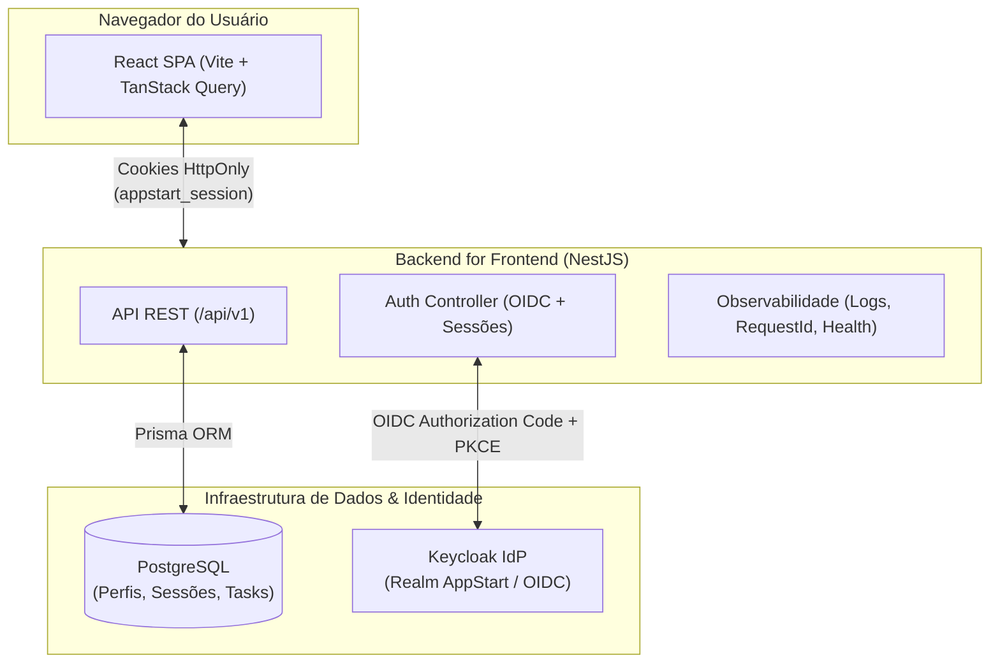
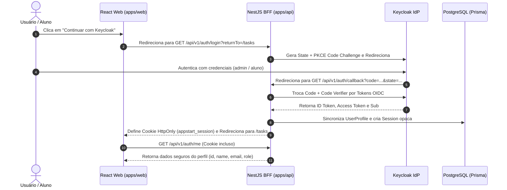
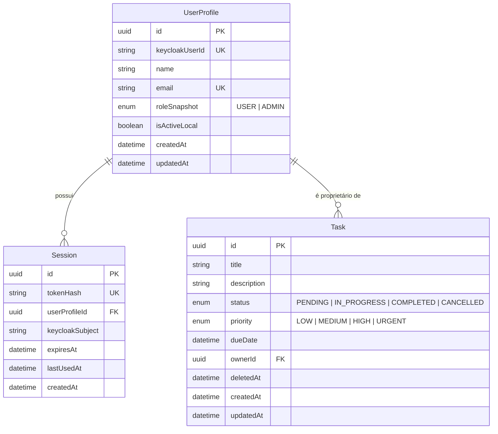

# Visão Geral da Arquitetura do AppStart

O **AppStart** é um template pedagógico de arquitetura de software full stack projetado para ensinar padrões profissionais de engenharia de software, segurança de identidade (OIDC/Keycloak), tipagem ponta a ponta e separação de responsabilidades.

---

## 🏗️ 1. Topologia do Sistema

---

## 🔐 2. Fluxo de Autenticação OIDC e Sessão BFF

---

## 🗄️ 3. Modelo de Dados Relacional (ER)

---

## 📋 4. Catálogo Canônico de Endpoints da API

| Método | Endpoint | Proteção | Papel Mínimo | Descrição |
| :--- | :--- | :--- | :--- | :--- |
| `GET` | `/health/live` | Público | - | Verificação de processo vivo (*liveness*) |
| `GET` | `/health/ready` | Público | - | Verificação de prontidão com banco (*readiness*) |
| `GET` | `/api/v1/auth/login` | Público | - | Inicia fluxo OIDC no Keycloak |
| `GET` | `/api/v1/auth/callback` | Público | - | Processa retorno do Keycloak e emite sessão |
| `GET` | `/api/v1/auth/me` | Sessão | `USER` | Consulta perfil e sessão ativa do usuário |
| `GET` | `/api/v1/auth/account` | Sessão | `USER` | Redireciona para o Console de Conta do Keycloak |
| `POST` | `/api/v1/auth/logout` | Sessão + CSRF | `USER` | Revoga a sessão local ativa |
| `POST` | `/api/v1/auth/logout-all` | Sessão + CSRF | `USER` | Revoga todas as sessões do usuário |
| `GET` | `/api/v1/admin/access-check` | Sessão | `ADMIN` | Verificação de privilégios administrativos |
| `GET` | `/api/v1/users` | Sessão | `ADMIN` | Listagem paginada e filtrada de usuários |
| `POST` | `/api/v1/users` | Sessão + CSRF | `ADMIN` | Provisiona novo usuário no Keycloak |
| `GET` | `/api/v1/users/:id` | Sessão | `ADMIN` | Detalhes de um usuário específico |
| `PATCH` | `/api/v1/users/:id` | Sessão + CSRF | `ADMIN` | Atualiza dados de um usuário |
| `PATCH` | `/api/v1/users/:id/status` | Sessão + CSRF | `ADMIN` | Ativa ou desativa um usuário |
| `PATCH` | `/api/v1/users/me` | Sessão + CSRF | `USER` | Autoatendimento de perfil (nome) |
| `GET` | `/api/v1/tasks` | Sessão | `USER` | Lista tarefas com paginação, busca e filtros |
| `POST` | `/api/v1/tasks` | Sessão + CSRF | `USER` | Cria nova tarefa com ownership |
| `GET` | `/api/v1/tasks/:id` | Sessão | `USER` | Detalhes da tarefa (owner ou admin) |
| `PUT` | `/api/v1/tasks/:id` | Sessão + CSRF | `USER` | Atualiza tarefa respeitando regras de transição |
| `DELETE`| `/api/v1/tasks/:id` | Sessão + CSRF | `USER` | Remoção lógica (*soft delete*) da tarefa |

---

## ⚙️ 5. Diferenças entre Desenvolvimento e Produção

| Aspecto | Ambiente de Desenvolvimento (`development`) | Ambiente de Produção (`production`) |
| :--- | :--- | :--- |
| **Formato de Logs** | Colorido e legível no terminal (`NestLogger`) | JSON Estruturado com `requestId`, `timestamp` e `level` |
| **Segredos e Credenciais** | Valores padrão documentados no `.env.example` | Variáveis injetadas via Vault, KMS ou CI/CD secrets |
| **Cookies de Sessão** | `Secure: false` (para suporte a `http://localhost`) | `Secure: true` (estritamente sobre conexões HTTPS) |
| **Swagger UI** | Habilitado em `/api/docs` | Desabilitado ou protegido sob firewall corporativo |
| **Banco de Dados** | Docker Compose local com seed (`pnpm db:seed`) | PostgreSQL gerenciado com backups e migrations via pipeline |
| **Keycloak** | Instância local Docker na porta `8080` com realm importado | IdP corporativo de alta disponibilidade com TLS |
