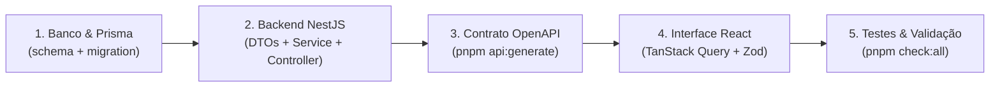

# Guia de Desenvolvimento de Novas Funcionalidades

Este guia explica como adicionar novos módulos e funcionalidades ao template **AppStart** seguindo o fluxo de engenharia de software correto e profissional.

---

## 🎯 As 5 Etapas de Construção de um Módulo



---

### Passo 1: Modelagem Relacional & Migrations (Prisma)
1. Abra `apps/api/prisma/schema.prisma` e adicione o novo modelo.
2. Certifique-se de incluir:
   - Identificador UUID: `id String @id @default(dbgenerated("gen_random_uuid()")) @db.Uuid`.
   - Vínculo de propriedade: `ownerId String @db.Uuid` e `owner UserProfile @relation(...)`.
   - Remoção lógica: `deletedAt DateTime?` com índice `@@index([deletedAt])`.
   - Timestamps: `createdAt DateTime @default(now())` e `updatedAt DateTime @updatedAt`.
3. Crie a migration SQL versionada em `apps/api/prisma/migrations/YYYYMMDD_<nome_modulo>/migration.sql` com consultas SQL numeradas.
4. Aplique a migration:
   ```bash
   pnpm db:migrate
   pnpm --dir apps/api exec prisma generate --schema prisma/schema.prisma
   ```
5. **Validação do Passo 1:** Teste a criação da tabela no PostgreSQL:
   ```bash
   PGPASSWORD=appstart_dev_password_change_me psql -h localhost -p 5432 -U appstart -d appstart -c "\d sua_tabela"
   ```

---

### Passo 2: Backend NestJS (DTOs, Service & Controller)
1. Crie o diretório em `apps/api/src/<modulo>/`.
2. Defina os DTOs com `class-validator` e anotações `@ApiProperty()` do Swagger:
   - `create-<modulo>.dto.ts`
   - `update-<modulo>.dto.ts`
   - `<modulo>.dto.ts` (DTO de saída)
   - `list-<modulo>-query.dto.ts` (estendendo `PaginationQueryDto`)
3. Implemente o `<modulo>.service.ts`:
   - Regras de validação de negócio específicas.
   - Aplicação de controle de ownership: `where: { ownerId: user.id, deletedAt: null }` (permitindo bypass para `ADMIN`).
   - Remoção lógica: `deletedAt = new Date()`.
4. Crie os testes unitários do serviço em `<modulo>.service.spec.ts`.
5. Implemente o `<modulo>.controller.ts`:
   - Anote com `@ApiTags('<modulo>')` e `@ApiBearerAuth()`.
   - Injete o usuário logado com `@CurrentUser() user: SafeUserProfile`.
6. Registre o módulo em `<modulo>.module.ts` e importe-o no `apps/api/src/app.module.ts`.
7. **Validação do Passo 2:** Execute os testes do backend:
   ```bash
   pnpm --dir apps/api test
   ```

---

### Passo 3: Sincronização do Contrato OpenAPI & Cliente TypeScript
1. Regenere a especificação OpenAPI e o cliente Orval:
   ```bash
   pnpm api:generate
   ```
2. Verifique se o contrato está 100% sincronizado:
   ```bash
   pnpm api:check
   ```
3. O arquivo `openapi.json` e os hooks/funções em `apps/web/src/lib/api-client/` agora contêm as chamadas tipadas do seu novo módulo.

---

### Passo 4: Interface Web React & UX
1. Crie a tela em `apps/web/src/pages/<modulo>-page.tsx`.
2. Integre com **TanStack React Query**:
   ```typescript
   const { data, isLoading, isError, refetch } = useQuery({
     queryKey: ['<modulo>', { page, search }],
     queryFn: async () => {
       const res = await moduloControllerFindAll({ page, pageSize: 10, search });
       return res.data;
     },
   });
   ```
3. Crie formulários tipados com **React Hook Form** e **Zod**:
   ```typescript
   const formSchema = z.object({
     title: z.string().min(3).max(150),
   });
   ```
4. Trate os estados de UX utilizando os componentes padronizados:
   - `<LoadingState />` para carregamento.
   - `<EmptyState />` quando a lista estiver vazia.
   - `<ErrorState onRetry={...} />` para falhas na API.
   - `<ActionFeedback />` para notificações de sucesso/erro.
5. Adicione a rota em `apps/web/src/App.tsx` e o item de navegação no `apps/web/src/components/layout/auth-layout.tsx`.
6. Crie o teste de componente em `apps/web/src/pages/<modulo>-page.spec.tsx`.

---

### Passo 5: Validação Final e Checklist de Entrega
Execute a suíte de verificação integrada completa:
```bash
pnpm check:all
```
- [x] Testes unitários da API passando (`pnpm --dir apps/api test`).
- [x] Testes unitários do frontend passando (`pnpm --dir apps/web test`).
- [x] Build de produção do frontend sem erros de TypeScript (`pnpm --dir apps/web build`).
- [x] Contrato OpenAPI e cliente Orval sincronizados (`pnpm api:check`).
- [x] Integridade documental verificada (`pnpm docs:check`).
