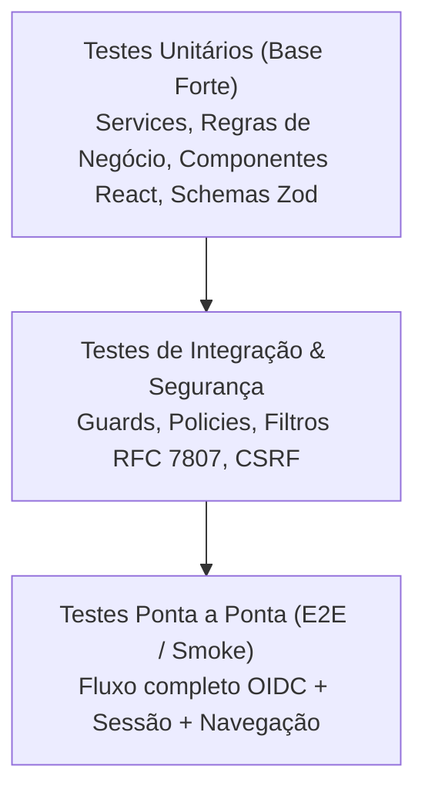

# Estratégia e Guia de Testes do AppStart

O **AppStart** adota uma estratégia de testes em pirâmide para garantir estabilidade, segurança e facilidade de depuração para alunos e mantenedores.

---

## 🔺 Pirâmide de Testes



---

## 🧪 1. Testes Unitários no Backend (NestJS + Vitest)

* **Localização:** Arquivos `*.spec.ts` próximos aos arquivos sob teste.
* **Ferramenta:** [Vitest](https://vitest.dev) configurado para execução ultrarrápida com compilação nativa.
* **O que testar:**
  - Regras de negócio de cada `Service` (ex.: transições de status inválidas, validação de datas no passado).
  - Invariantes de segurança (ex.: garantia de que senhas e segredos nunca são serializados).
  - Políticas de autoatendimento (ex.: bloqueio de alteração de papéis em `/users/me`).
  - Filtros de exceção RFC 7807 (`ProblemDetailsFilter`).
  - Guards de proteção CSRF (`CsrfGuard`).

### Como executar:
```bash
# Executar todos os testes do backend
pnpm --dir apps/api test

# Executar em modo observador (watch) durante o desenvolvimento
pnpm --dir apps/api exec vitest
```

---

## ⚛️ 2. Testes de Interface no Frontend (React + Vitest + Testing Library)

* **Localização:** Arquivos `*.spec.tsx` em `apps/web/src/`.
* **Ambiente:** `jsdom` com `@testing-library/react` e `@testing-library/jest-dom`.
* **O que testar:**
  - Gerenciamento e alternância de temas (`ThemeContext`, persistência no `localStorage`).
  - Proteção de rotas (`ProtectedRoute` redirecionando visitantes não-autenticados para `/login?returnTo=...` e bloqueando papéis não autorizados).
  - Componentes de formulários e estados visuais (exibição de mensagens de erro do Zod, estados vazios e alertas de sucesso).

### Como executar:
```bash
# Executar todos os testes do frontend
pnpm --dir apps/web test

# Executar em modo observador (watch)
pnpm --dir apps/web exec vitest
```

---

## 🔍 3. Testes de Contrato de API (OpenAPI & Drift Detection)

* **Script:** `scripts/check-api-divergence.mjs` (disponível via `pnpm api:check`).
* **Objetivo:** Detectar imediatamente qualquer discrepância entre os decorators do NestJS, o schema `openapi.json` e os tipos gerados do Orval.
* **Comportamento em CI:** A pipeline falha se o desenvolvedor alterar um endpoint na API mas esquecer de rodar `pnpm api:generate`.

### Como executar:
```bash
pnpm api:check
```

---

## 🚀 4. Executando a Suíte Completa

Para rodar todas as validações de uma só vez antes de criar um commit ou submeter um trabalho:
```bash
pnpm check:all
```
Este comando executa:
1. Testes do Backend (`apps/api test`)
2. Testes do Frontend (`apps/web test`)
3. Build estático do Frontend (`apps/web build`)
4. Verificação de Divergência de Contrato (`api:check`)
5. Verificação de Integridade de Documentação (`docs:check`)
